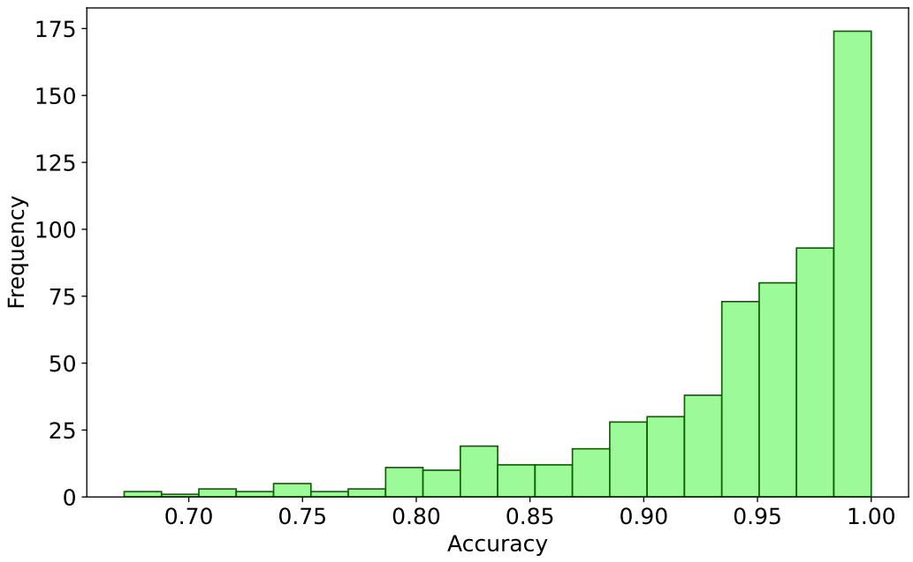

# Evaluating Electro-Optical Frequency Mapping Attack Leakage in Integrated Circuits using Graph Neural Networks


# Description
This project aims to reduce the runtime of leakage estimation compared to traditional algorithmic approaches, which rely on repeatedly solving a Boolean satisfiability problem with exponential time complexity.

**Key Words and Phrases：** `hardware security` `graph neural networks` `data augmentation` `combinational circuits` `side-channel analysis and countermeasures` `Logic locking` `electro-optical frequency mapping` `untrusted foundry`

# Abstract
This work introduces a novel approach to assess Electro-Optical Frequency Mapping key information leakage in Integrated Circuit (IC)
designs. Modern ICs contain high-value Intellectual Property (IP). However, for economic reasons, they are often produced in untrusted
fabrication facilities. IC applications vary, ranging from multi-million-dollar corporate ventures to military uses. Consequently, logic
obfuscation techniques have been developed to protect this high-value IP in these devices during fabrication. Optical side-channel
attacks, such as the CLAP attack, have demonstrated the capability to infer and unlock the keys of obfuscated circuits, potentially leaking high-value IP to an untrusted fabrication partner. These attacks extract leakage noninvasively, based on the standard cell placement within an IC. With the growing complexity of modern IC modules, there is a corresponding need for enhanced protection against
hardware security risks. This approach aims to explore and utilize Graph Neural Networks (GNNs) to estimate the optical leakage
of logic obfuscation. Such an approach will allow IC designers to quickly identify regions of a chip that may leak key information,
enabling them to apply remediation strategies. To estimate key leakage, various strategies were explored, ultimately adopting a
supervised learning approach with specifically designed features. The model employs a Graph Neural Network (GNN) architecture,
consisting of two SAGE convolutional layers and an intermediate dropout layer, to estimate circuit leakage. The effectiveness of this
methodology was evaluated using two IC benchmarks, with the best-trained model consistently achieving over 94% accuracy on
average across the benchmarks. Comprehensive analyses of these results were also performed to provide deeper insights into the
model’s performance. This approach offers a potential reduction in the runtime of leakage estimation when compared to conventional
algorithmic methods, which typically involve solving a Boolean satisfiability problem with exponential time complexity.

## Results and visuals

<p align="center">
  
&nbsp; &nbsp; &nbsp; &nbsp;
  
</p>

> **Left Figure:** Model frameworks, **Right Figure:** F1 score behavior graph for training and validation

<p align="center">
  
&nbsp; &nbsp; &nbsp; &nbsp;
  
</p>

> **Left Figure:** Accuracy distribution over test set, **Right Figure:** Model assesment time to circuit size (total nodes in circuit)

#

# Project details and instructions
## Requirements
These libraries are not necessarily the only versions that would work properly. They are, however, the versions used to obtain the recorded results included as a reference.
- Python = 3.7.9
- torch = 1.13.1
- dgl = 1.1.2
- matplotlib = 3.5.3
- networkx = 2.6.3
- numpy = 1.21.6
```
pip install torch dgl matplotlib networkx numpy
```
## Datasets
data_total_xor4k - training dataset utilized to train the best model attached.
- `CLAP_set` -> benchmark circuits set [1] with features and ground truth files for resolution 2, 4 in folder `CLAP_set/g2_gt`, `CLAP_set/g4_gt` respectively.
- `SAT_set` -> benchmark circuits set [1] with features and ground truth files for resolution 2, 4 in folder `SAT_set/g2_gt`, `SAT_set/g4_gt` respectively.
- `Unseen_set` -> circuits set with unseen topologies, features and ground truth files for resolution 2 included in folder `test_comprehensive/g2_gt`.
- `test_comprehensive` -> A comprehensive test set combining all the sets above, features and ground truth files for resolution 2 included in folder `test_comprehensive/g2_gt`.

## Usage
There are several programs in this repository. Below is a quick description of each:

1. `clean_up_keyinput.py` includes data augment function which cleans up key inputs in benchmark circuit files with the expected format.
2. `add_keyinputs.py` includes data augment function which adds key inputs.
3. `train_model.py` includes an example training process.
4. A demonstration of the model without a Command Line Interface (CLI) is provided by `demo_model_usage.py`.
5. `process_log` extract relavent information and display figures from the output log from `demo_model_usage.py` for further analysis. 
6. A demo of the model with CLI can be used as follows:
```
https://github.com/rwiyty/gnn_eofm.git
```
navigate to ../your_path_to/gnn_eofm
```
python GNN_EOFM.py --f demo_bench --m wBest15_model_auto2kT7.pth
```
replace "demo_bench" and "bestwBest15_model_auto2kT7_model.pth" with your own dataset's folder name and model name if needed.

## Future work
The current demo model is trained specifically for gate pairings. Ideally, to enhance its applicability, separate models should be developed for each desired resolution. While the model achieves over 90% accuracy on the majority of test circuits, it tends to underperform on certain types of leakage, indicating a need for targeted improvements in these areas. Additionally, feature extraction is presently based on outputs from CLAP toolkit [1] and the adjoining-gate program, credited to Thomas Wojtal. Future iterations should include the implementation of additional feature extraction functions to fully realize the project's potential.

## Authors and acknowledgment
Authors: Yuyang Wang (primary), Yuntao Liu, Cory Merkel, and Michael Zuzak

For questions, please reach out to:

Yuyang Wang yw3158@rit.edu or Michael Zuzak mjzeec@rit.edu | Department of Computer Engineering | Rochester Institute of Technology (RIT)

Tool utilized to produce ground truth and certain features (credit to Thomas Wojtal):
```
https://github.com/twojtal/Adjoining-Gate.git
```

Additional relavent toolkits and citations
```
https://github.com/mzuzak/CLAP_Attack.git

[1] Michael Zuzak, Yuntao Liu, Isaac McDaniel, and Ankur Srivastava. 2022. A Combined Logical and Physical Attack on Logic Obfuscation. In Proceedings of the 41st IEEE/ACM International Conference on Computer-Aided Design (, San Diego, California,) (ICCAD ’22). Association for Computing Machinery, New York, NY, USA, Article 68, 9 pages. https://doi.org/10.1145/3508352.3549349

[2] A. Mishchenko. 2005. ABC: A System for Sequential Synthesis and Verification. https://people.eecs.berkeley.edu/~alanmi/abc/ Available online:
https://people.eecs.berkeley.edu/~alanmi/abc/. Last updated: September 20, 2012. Accessed on: March 23, 2024.
```